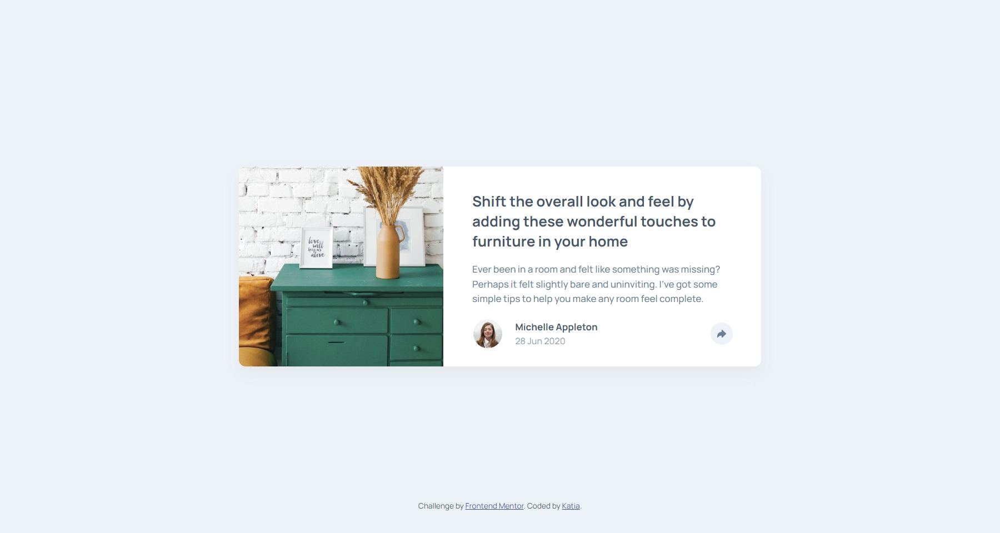
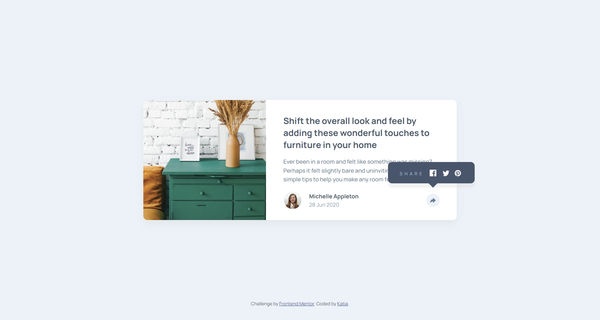
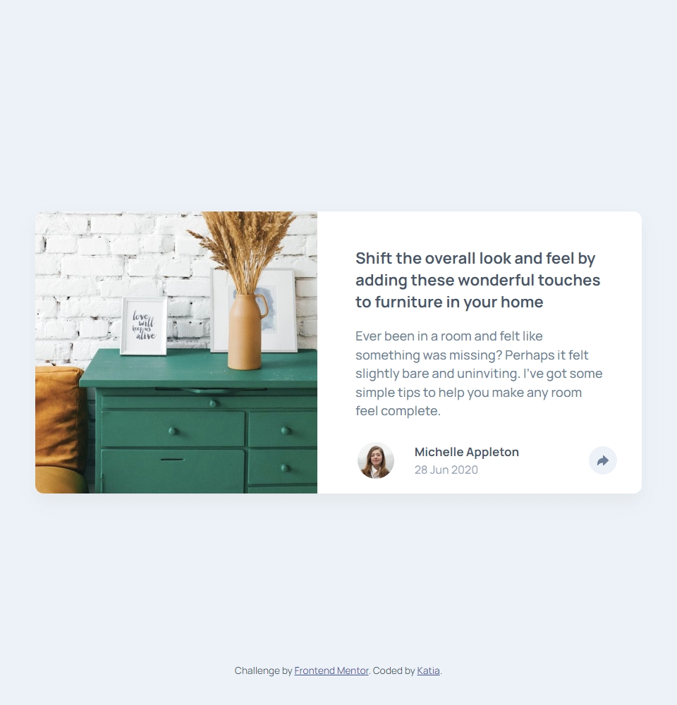
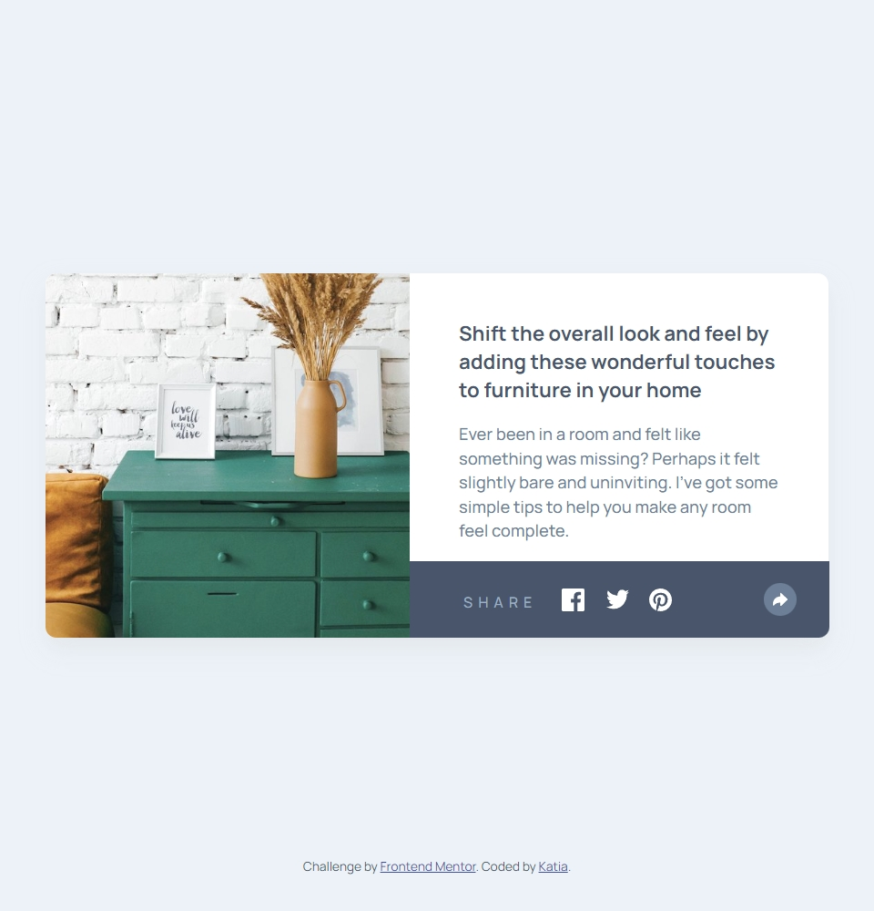
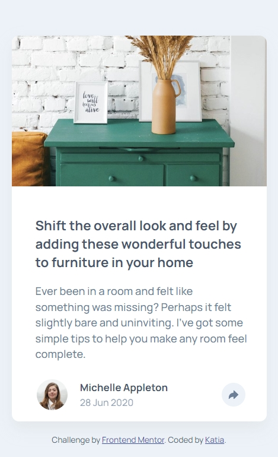
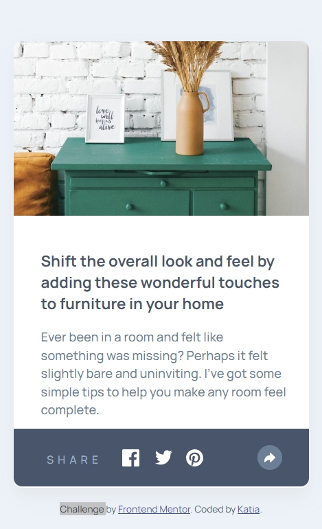

# Frontend Mentor - Article preview component solution

This is a solution to the [Article preview component challenge on Frontend Mentor](https://www.frontendmentor.io/challenges/article-preview-component-dYBN_pYFT). Frontend Mentor challenges help you improve your coding skills by building realistic projects. 

## Table of contents

- [Overview](#overview)
  - [Screenshot](#screenshot)
- [My process](#my-process)
  - [Built with](#built-with)

## Overview

Simple article preview, where users should be able to:

- View the optimal layout for the component depending on their device's screen size
- See the social media share links when they click the share icon

### Screenshot

 
 
 

## My process

I did the layout faster that on previous challenges, where I got really stuck on, was in the part of make the socials menu appear and disappear when active, but after a while doing my research online I could finally come with a solution. I'm happy with the result, I know that I still have a lot to practice but I feel good with this one. 

### Built with

- HTML5
- CSS
- JavaScript